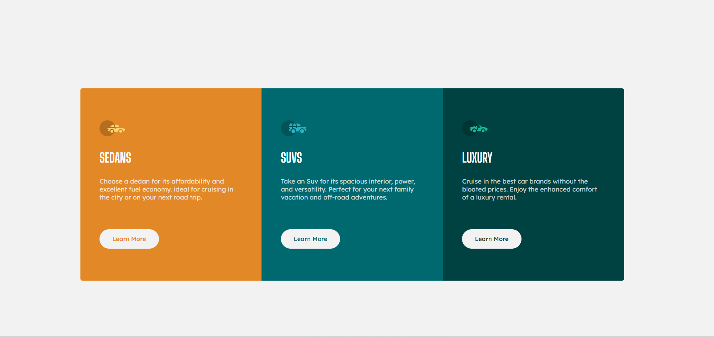

# Frontend Mentor - 3-column preview card component solution

This is a solution to the [3-column preview card component challenge on Frontend Mentor](https://www.frontendmentor.io/challenges/3column-preview-card-component-pH92eAR2-). Frontend Mentor challenges help you improve your coding skills by building realistic projects. 

**Note: Delete this note and update the table of contents based on what sections you keep.**

## Overview

### Screenshot

### Links

- Solution URL: [Code Solutions](https://github.com/olusesimrg/flexbox-grid.git)
- Live Site URL: [Live Site](https://olusesimrg.github.io/flexbox-grid/)

### Built with

- Semantic HTML5 markup
- CSS custom properties
- Flexbox

## Author

- Frontend Mentor - [@Olusesimrg](https://www.frontendmentor.io/profile/olusesimrg)
- Twitter - [@olusesimrgee](https://www.twitter.com/olusesimrgee)

